### 签到

标准签到题，base64解之

### OWASP

PDF隐写，用wbStego4open提取信息（无密码），提取的信息如下

	C9t, ln R DRrger YenY, we cRn not dedlcRte, we cRn not conYecrRte, we cRn not 0RDDow t0lY gro9nd. T0e brRve men, 
	Dlvlng Rnd deRd, w0o Y4r9ggDed 0ere, 0Rve conYecrRted lt, fRr Rbove o9r poor power to Rdd or detrRct. T0e worDd 
	wlDD DlttDe note, nor Dong remember w0Rt we YRy 0ere, b9t lt cRn never forget w Rt t0ey dld 0ere. It lY for 9Y t0e
	 Dlvlng, rR40er, to be dedlcRted 0ere to t0e 9nflnlY0ed worW w0lc0 t0ey w0o fo9g0t 0ere 0Rve t09Y fRr Yo nobDy 
	RdvRnced. It lY rRt0er for 9Y to be 0ere dedlcRted to t0e greRt tRYW remRlnlng before 9Y—t0Rt from t0eYe 0onored 
	deRd we tRWe lncreRYed devotlon to t0Rt cR9Ye for w0lc0 t0ey gRve t0e DRYt f9DD meRY9re of devotlon t0Rt we 0ere 
	0lg0Dy reYoDve t0Rt t0eYe deRd Y0RDD not  Rve dled ln vRln—t0Rt t0lY nRtlon, 9nder xod, Y0RDD 0Rve R new blrt0 of 
	freedom—Rnd t0Rt government of t0e peopDe, by t0e peopDe, for t0e peopDe, Y0RDD not perlY0 from t0e eRrt0.6zU3Px
	{Cl9Cl9Y0RWRDRWR}

替换加密，手工分析，根据常见英文单词，替换该替换的，最后拿到flag

### 埃及神战

发现少了个funcD函数，修改func函数的偏移，使其偏移指向funcD函数。

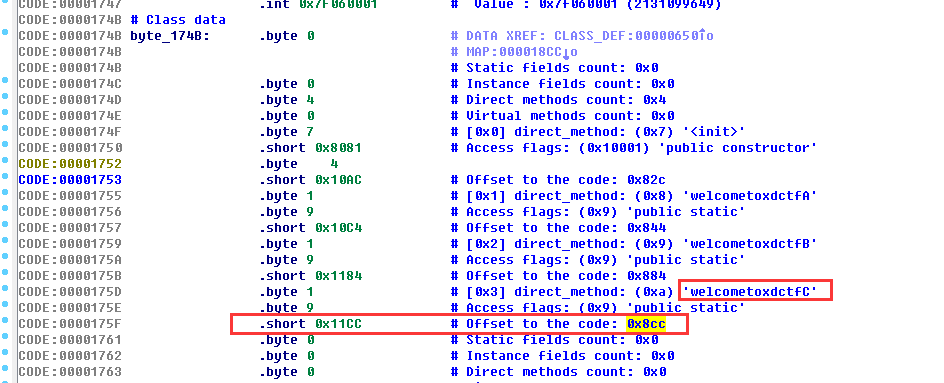

随后使用dex2jar，用JD-GUI打开，直接看D的源码。

	java
	int i = 0;
	int j = "75b49434e484471493d5c6e3c774c3d7c3f405f427".length();
	byte[] arrayOfByte2 = new byte[j / 2 + 1];
	int k = i;
	while (k < j)
	{
		int m = k / 2;
		int n = Character.digit("75b49434e484471493d5c6e3c774c3d7c3f405f427".charAt(k), 16) << 4;
		int i1 = k + 1;
		int i2 = Character.digit("75b49434e484471493d5c6e3c774c3d7c3f405f427".charAt(i1), 16);
		int i3 = (byte)(n + i2);
		arrayOfByte2[m] = i3;
		k += 2;
	}
	byte[] arrayOfByte1 = new byte["75b49434e484471493d5c6e3c774c3d7c3f405f427".length() / 2];
	k = 0;
	int i4 = 0;
	while (true)
	{
		int i5 = arrayOfByte2.length + -1;
		if (i4 >= i5)
		break;
		int i6 = (byte)(arrayOfByte2[i4] ^ 0xF0);
		arrayOfByte1[k] = i6;
		i4 += 1;
		k += 1;
	}
	i4 = arrayOfByte1.length;
	String str1 = new String();
	while (i < i4)
	{
		String str2 = String.valueOf(str1);
		StringBuilder localStringBuilder1 = new StringBuilder(str2);
		String str3 = Integer.toHexString(arrayOfByte1[i] >> 4 & 0xF);
		String str4 = String.valueOf(str3);
		StringBuilder localStringBuilder2 = new StringBuilder(str4);
		String str5 = Integer.toHexString(arrayOfByte1[i] & 0xF);
		str1 = str5;
		i += 1;
	}
	return str1;

一发脚本带走

	 python
	str ='75b49434e484471493d5c6e3c774c3d7c3f405f427'.decode('hex')
	a = ''
	for x in str:
		a+=hex(ord(x)^0xf0).replace('0x','').rjust(2,'0')
	print a

### 穿针引线

jeb打开apk文件，发现验证用到了so文件，用IDA开打SO文件，分析函数，发现函数调用了java层的fun1和fun2进行验证。

其中fun1返回固定的md5字符串，fun2将该字符串和输入的flag作为参数进行验证，fun2如下

	java
	public static int func2(String data1, String data2) {
	    StringBuilder v1 = new StringBuilder();
	    int v0;
	    for(v0 = 0; v0 < data1.length(); ++v0) {
	        v1.append(Functions.hexString.charAt((Functions.hexString.indexOf(data1.charAt(v0)) + 5)
	                 % 16));
	    }
	
	    int v2 = v1.toString().equals(data2) ? 1 : 0;
	    return v2;
	}

一发脚本带走

	python
	v1 = 'f98c82b42051c8e6c42359678fb39c90'
	hexString = "0123456789abcdef"
	i = 0
	flag = ''
	while i< len(v1):
		for x in hexString:
			if hexString[(hexString.index(x) + 5) % 16] ==v1[i]:
				flag+=x
				i =i+1
				break
	print flag

### 此地无银六百两

两个验证函数都在SO文件里，用IDA打开分析。

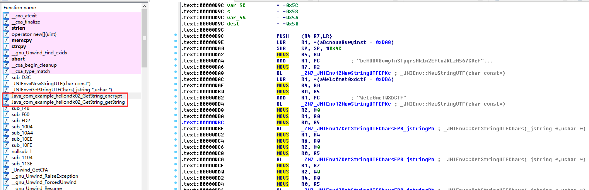

对encrypt进行分析，第一个字符串很快就能出来。

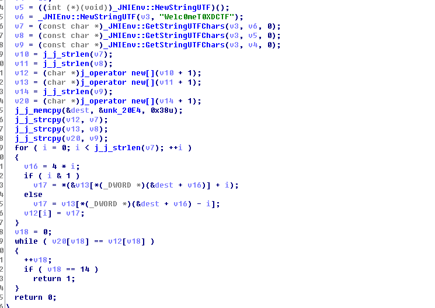

一发脚本跑flag

	 python
	v7  = 'Welc0meT0XDCTF'
	
	index = [0x20,0x19,3,-2,0x29,0xC,0x26,0x1F,0x22,0xB,0x47,0x22,0x43,0xF,0x20,3,0x19,3,-2,0x29,0xB,0xB,0x22,0x22,2,0x26,0x43,0xF]
	str = 'bcNOUV8vwyInSTpqrsHklm2EFtuJKLzM567CDefghijAB09XYZadoPQRGx134W'
	flag = ''
	i = 0
	while i<len(v7):
		if i&1:
			flag += str[index[i]+i]
		else:
			flag += str[index[i]-i]
		i+=1
	print flag
	
	#5ucces5fulW0RK
另一个验证函数很相似，也是相同的脚本。。但不知道为什么跑出来不对，这题也就因为这边卡住了。

	python
	
	v7  = 'Welc0meT0XDCTF'
	index = [0x20,3,0x19,3,-2,0x29,0xB,0xB,0x22,0x22,2,0x26,0x43,0xF]
	str = 'bcNOUV8vwyInSTpqrsHklm2EFtuJKLzM567CDefghijAB09XYZadoPQRGx134W'
	flag = ''
	i = 0
	while i<len(v7):
		if i&1:
			flag += str[index[i]+i]
		else:
			flag += str[index[i]-i]
		i+=1
	print flag
	reslut = 0
	for x in flag:
		reslut += ord(x)
	print reslut
	#5UE8G9VHuAQZRK

### 验证码

发现验证码总共就2000个。。。  直接做成字典，key在响应头里，写个py直接跑就可以了。时间有限，没做。

### 迷途

根据提示应该是XPATH注入，不擅长，没做。

### 登陆的技巧

写了php脚本在跑secret，5位的时候，出了。。但不对

	 php
	
	<?php
	
	for($x1=ord('0');$x1<127;$x1++)
	{
		for($x2=ord('0');$x2<127;$x2++)
		{
			for($x3=ord('0');$x3<127;$x3++)
			for($x4=ord('0');$x4<127;$x4++)
			for($x5=ord('0');$x5<127;$x5++)
			if(crc32('admin123'.chr($x1).chr($x2).chr($x3).chr($x4).chr($x5)) == '2950046455')
			{
				echo chr($x1).chr($x2).chr($x3).chr($x4).chr($x5);
			}
			// echo crc32('admin123'.chr($x1).chr($x2).chr($x3).chr($x4))."\n";
		
		}
	}
	
	?>
	#secret = "[eF3`"

### Breach

猜测考察点为流密码

### 美女配英雄

这密码。。我真猜不到，从一位跑到5位大写字母，也是醉醉的，考察点难道不是暴力？

### 铁人三项赛

3个多G，原谅我的网速真的不行。。。

### 秘密信息

ZIP的密码是秒跑的，原谅我时间真的不够= =。

### 心里话

根据tips知道是曼彻斯特编码。。
观察数字全部为01 或者 10 记01 为1 ， 10 为0

	while (1)
		{
			char a = getchar();
			char b = getchar();
	
			if (a == '0'&&b == '1')
				printf("1");
			else if (a == '1'&&b == '0')
				printf("0");
			else
				printf("null");
		}
出来后是一个二维码 扫一下就好。

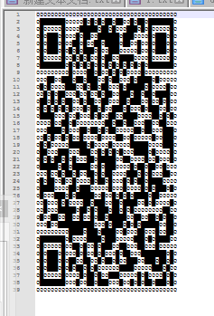

XDFLAG{WOO~YOU_HAVE_A_BIG_BRAIN-DONG}

### 伏羲剑

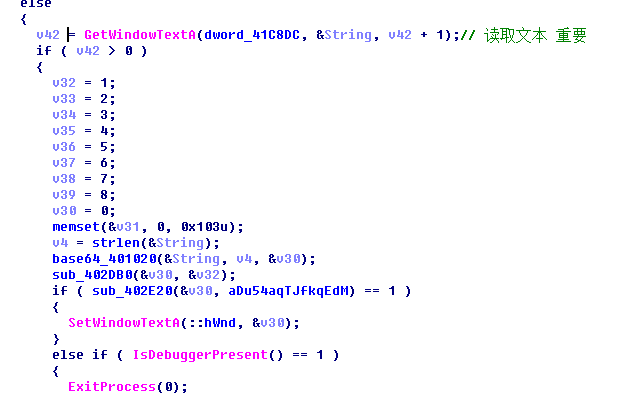

GetWindowText 读取了一个字符串 
401020是base64加密的脚本  通过动态可以看到

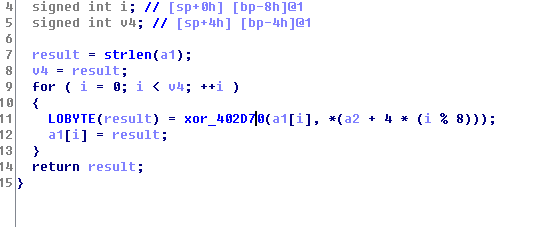

再 1.2.3.4.5.6.7.8依次循环异或.

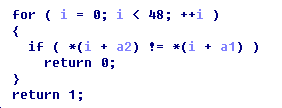

在和一个字符串比较。
逆推得到一个错误flag 

头痛的时候发现特征

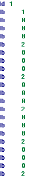
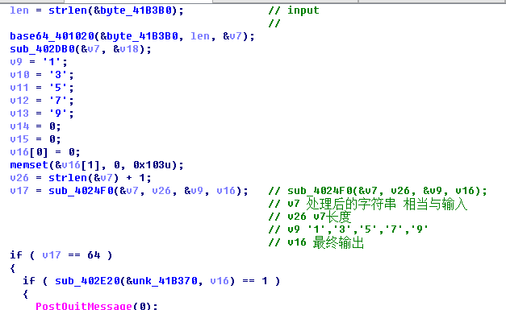

一下子才出是DES加密  密钥为 13579
然后再经过 和上面一样操作后
与unk_41B370比较逆推就可以得到flag

Flag 是 `XDFLAG{this_1s_a_small_di8h_for_y0u_today!}`

### 刮擦：

看到题目考虑直接爆破，四位大写字母爆破附上脚本

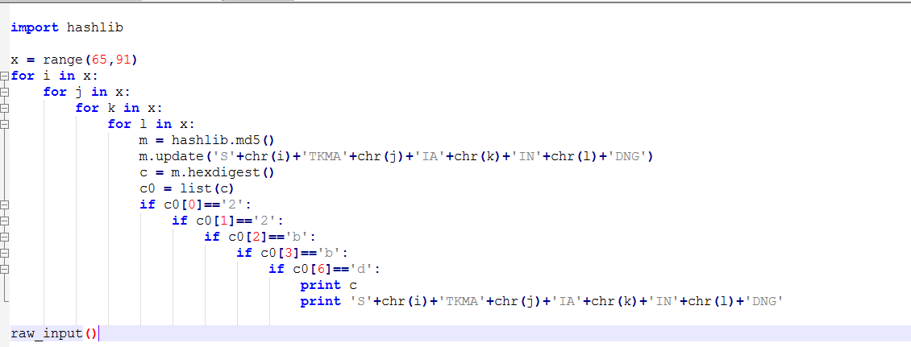

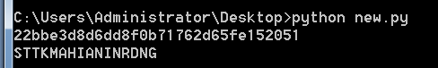

跑出来提交发现不对，猜测是古典密码，凯撒栅栏都试了试

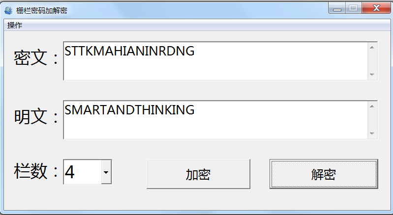

###　记事本

http://www.2cto.com/Article/201506/409324.html

参考这篇文档知道`KGS!@#$%` 的16进制为明文 题目中所给的 内容为 16进制的密钥 然后加密 合并 
hash 解密， 就可以得到flag为` XD2016CTF`

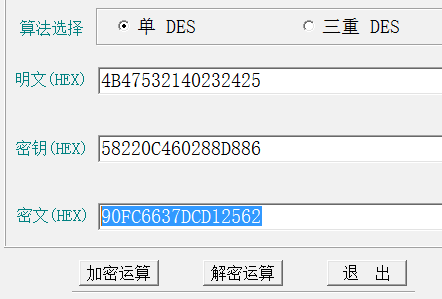 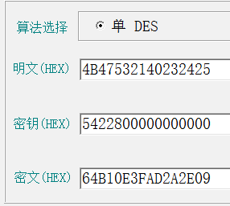

hash `90FC6637DCD1256264B10E3FAD2A2E09` 

通过逆向的推也是可以推出密码的 将16进制转化为2进制
然后再去掉末尾的0再合成8bit的2进制转化为 16进制推出ascii 一样能得到flag
